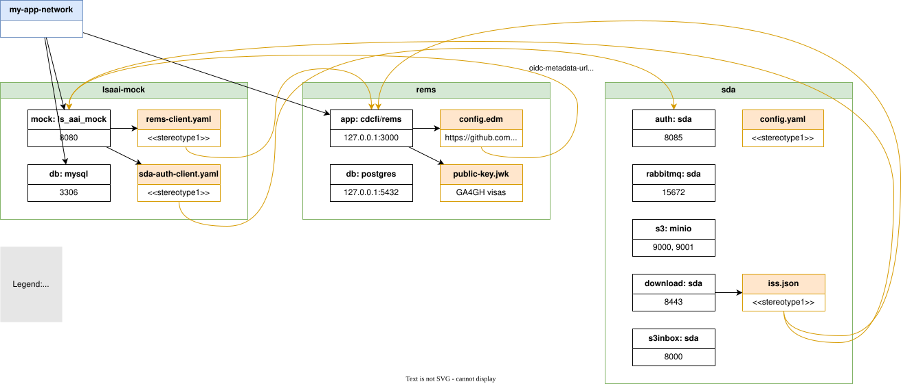

Introduction
---

This is a work in progress. This repository tries to deploy the GDI starter-kit stack in one place. 

* The starter-kit repositories are added as submodules of this repository. Use ```git clone --recurse-submodules ...``` to clone this repository with the submodules.
* [docker-compose.yml](docker-compose.yml) includes each submodule docker-compose and a corresponding ```override.yml```. These overrides contain all the modification that has to be performed to deploy the full stack. Use simply ```docker compose up``` to deploy the full stack.
* Extra configuration files are added in the configuration folder. Because the extra files are added to mounted volumes, Macos requires changing the following `Settings > General > Virtual Machine Options > file sharing implementation > gRPC FUSE`

Diagram
---
Diagram representing the components of the stack. It can be modified with the `Draw.io Integration` extension in VS-Code.



Modifications applied by this repository
---
1. Add the dependencies to starter-kits lsaai-mock, rems, and sda with `git submodule add ...`
2. lsaai-mock
   * The configuration/aai-mock is merged with the submodule default configuration
   * Created `configuration/aai-mock/clients/rems-client.yaml`
   * Use the environment variable `DOCKERHOST=aai-mock` so the main.oidc.issuer.url points to the container URL. 
     * TODO: this requires mapping aai-mock to localhost on the host's host configuration.
     * Both the rems service need to access aai-mock from the docker network, and the host browser needs to access aai-mock from the host network.
3. rems
   * Move the generation of JWK tokens in a service instead of the imperative `python generate_jwks.py`
   * Move the initialization of the database in a service instead of the imperative `docker-compose run --rm -e CMD="migrate" app`
   * Load the newly generate JWK tokens
   * Create `config.edn` pointing to lsaai-mock
   * Add the rems_app to the `lsaaimock` network

